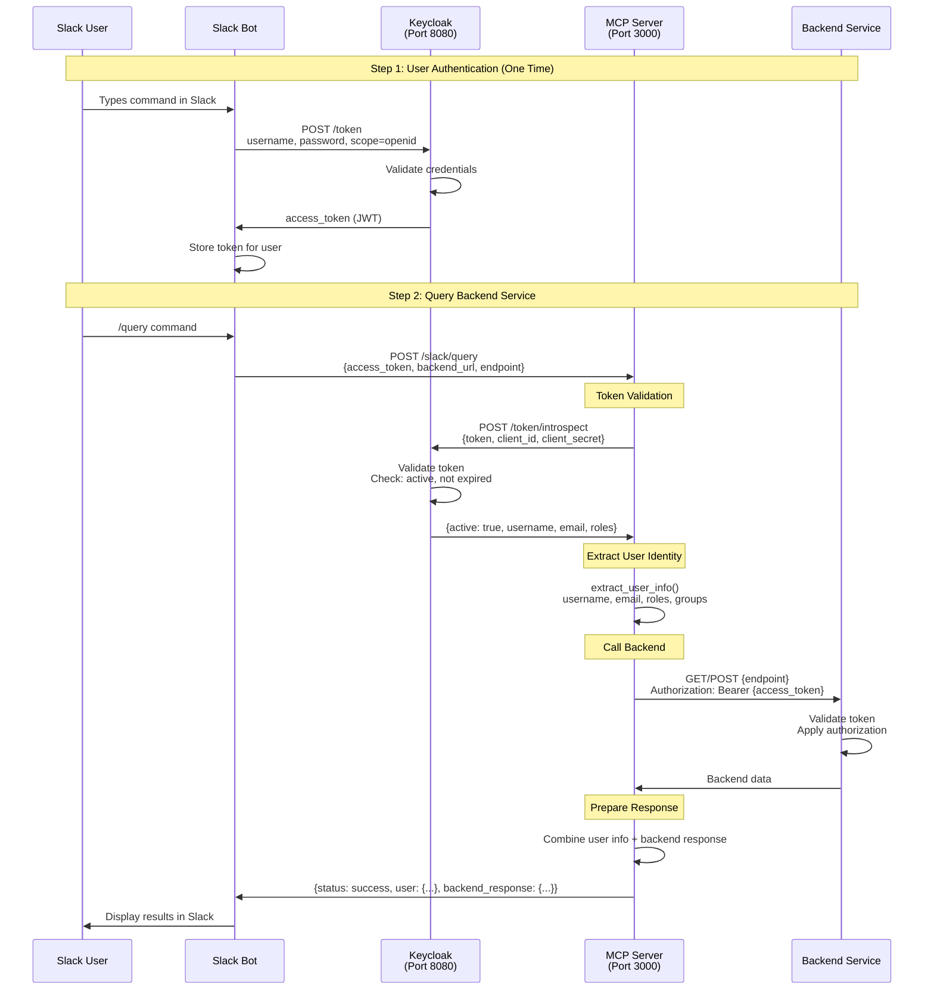
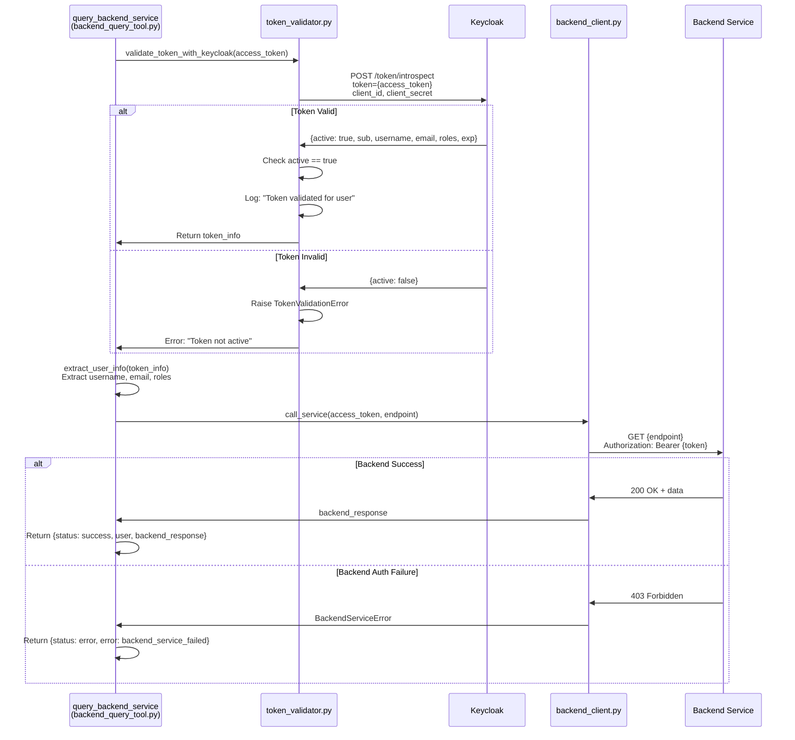
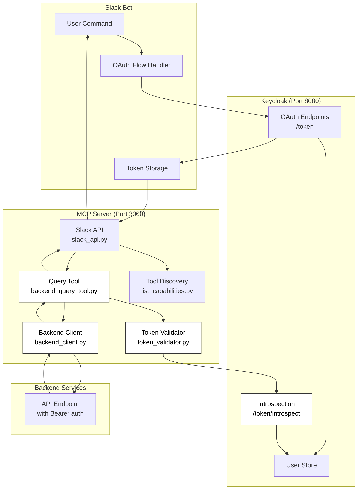

# Architecture Sequence Diagrams

## Complete Flow: Slack Bot → MCP Server → Backend

## Token Validation Detail

## Component Architecture

## Files Involved

| Step | File | Function |
|------|------|----------|
| 1. Entry | `slack_api.py` | `slack_query_backend()` |
| 2. Tool | `backend_query_tool.py` | `query_backend_service()` |
| 3. Validate | `token_validator.py` | `validate_token_with_keycloak()` |
| 4. Extract | `token_validator.py` | `extract_user_info()` |
| 5. Backend | `backend_client.py` | `call_service()` |
| 6. Return | `backend_query_tool.py` | Return combined response |

## Key Validation Points

1. **Token Introspection** (Line 46-54 in token_validator.py)
   - Calls: `POST http://localhost:8080/realms/master/protocol/openid-connect/token/introspect`
   - Sends: token, client_id, client_secret
   - Gets: active status, user info, roles

2. **Active Check** (Line 60-63 in token_validator.py)
   - Verifies: `token_info.get("active") == True`
   - Fails if: token expired, revoked, or invalid

3. **User Extraction** (Line 79-124 in token_validator.py)
   - Extracts: username, email, user_id, roles, groups
   - Supports: Multiple claim formats (Keycloak, Google, Red Hat SSO)

4. **Backend Call** (Line 64-95 in backend_client.py)
   - Adds: `Authorization: Bearer {access_token}` header
   - Backend validates token independently (two-tier auth)

